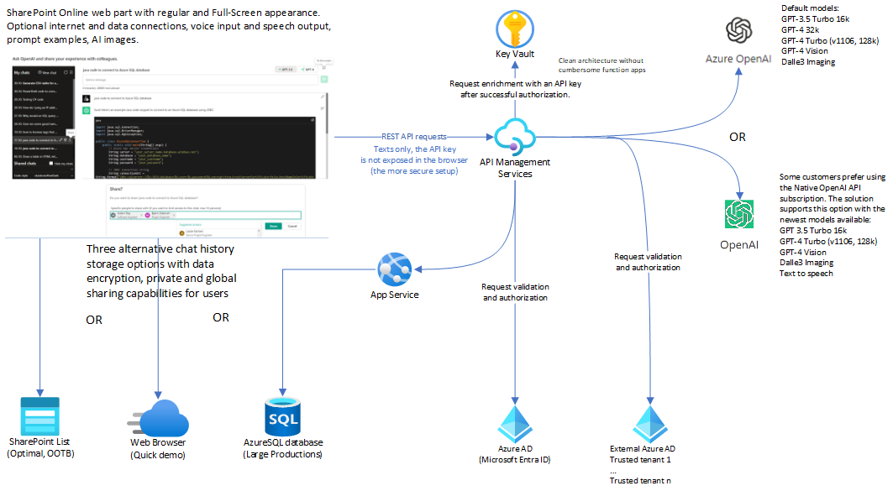
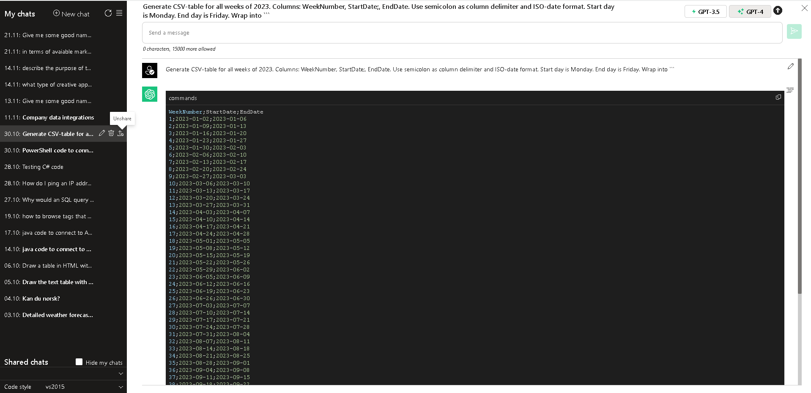
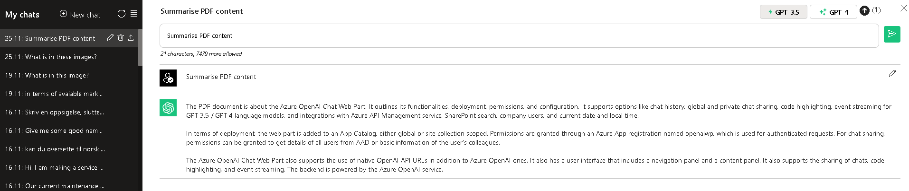
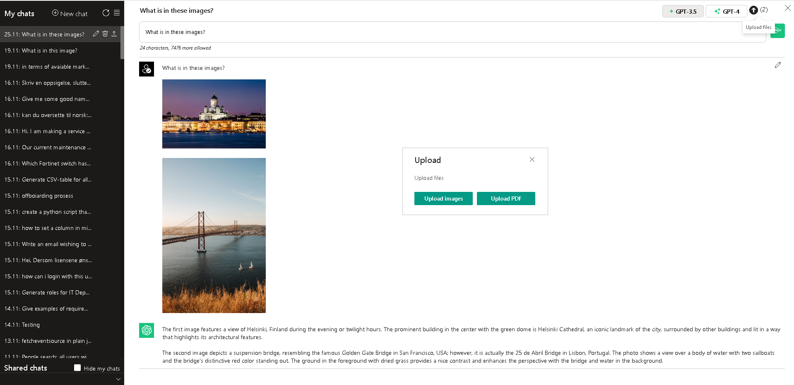

# Azure OpenAI Chat Web Part

This is an Azure OpenAI Chat Web Part for SharePoint Online, offering a user experience that is familiar to users of ChatGPT.

**Data Privacy**

The web part interacts with private **Azure OpenAI** endpoints that are published via Azure API Management service (APIM).

- By default, this setup provides enhanced data privacy. In this configuration, requests to AI do not travel outside your Azure tenant.
- APIM consistently validates the identities of SharePoint users for each individual request. If the request originates from authorized domains, APIM retrieves the **api-key** from the secure vault and injects it into the request before forwarding it to the AI endpoint. This process ensures that the api-key does not get exposed in the browser.
- Chats are private and visible only to their creators. Creators have the option to share their chats when this feature is enabled in the web part settings (disabled by default).
- The web part incorporates tampering prevention logic to guard against unauthorized access to another user's data by their GUID.
  
In addition to the default configuration, you have the option to publish the Native Open AI endpoint in APIM. You can find instructions in the [documentation](docs/azure-openai-chat-web-part.pdf) (page 7).

- CONS: Granting access to the Native Open AI endpoint requires a separate **api-key** for it and could potentially compromise data privacy, as requests might travel outside your Azure tenant under this setup.
- PROS: Using the Native OpenAI endpoint could grant you access to the latest language models like GPT-4 Vision and GPT-4 1106 Parallel processing that are not currently available in Azure OpenAI (as of November 2023).

In the simplest case, you can also use direct access to (Azure) Open AI endpoints, configured with an api-key explicitly stored in the web part properties.

- **This setup, while the least secure, can provide a quicker start.** It is not recommended for production use, but it can be used for quick tests or in situations where you do not have access to Azure API Management or Azure Open AI.
- The stored key is encrypted in the web part properties and displayed as \*\*\* in the Property Pane.
  However, it will travel in browser requests and can be viewed within the DEV tools > Network > Request headers.

The web part supports optional integrations with company data. For security reasons, these integrations are disabled by default and must be explicitly enabled in the web part settings.

The integrations available in this release include:

- SharePoint Search
- Company Users
- Local Date and Time
- Analysis of an uploaded PDF and summarization of its content
- Analysis of uploaded images and description of their content
- Beta 1.1: Search on the Internet (Bing Search). Added on Nov 29, 2023.

### Full-Scale Setup

### Credits

I would like to express my deep respect and admiration for Microsoft, the creators of the groundbreaking Azure OpenAI service.

I am immensely grateful to Advania Finland for providing me with the opportunity and resources to develop this project.

# Table of Content

- [Key features](../../releases/tag/v1)

- [Presentation](docs/azure-openai-chat-web-part-presentation.pdf)

- [Get Started Quickly in Visual Studio Code (DEV)](#get-started-quickly-in-visual-studio-code-dev)

- [Get Started Quickly with a prebuilt web part package](#get-started-quickly-with-a-prebuilt-web-part-package)

- [More Advanced Setup](#more-advanced-setup)

- [Full-Scale Setup for Large Environments](#full-scale-setup-for-large-environments)

- [Notes on npm install and associated warnings](#notes-on-npm-install-and-associated-warnings)

### User Interface

")

# Get Started Quickly in Visual Studio Code (DEV)

- [back to the top](#table-of-content)

This is the simplest and least secure setup.
You will not be able to use the Private Chat sharing feature unless you approve the corresponding [SPFx permissions](#spfx-permissions).

**Prerequisites**:

- Visual Studio Code with a development setup for building SPFx components, versions 1.16.1 - 1.18.0.
- You should have an **api-key** for Azure OpenAI instance, with configured endpoints for text models of GPT 3.5, and optionally, GPT 4.
  - Alternatively, you should have an **api-key** for Native OpenAI.

## Configurations

1. Clone the project.

2. Open the project in Visual Studio Code and navigate to View > Terminal

3. Execute the following commands

   - cd ./spfx-latest
   - npm i
   - gulp build
   - gulp serve --nobrowser
     - Alternatively, you can use fast-serve
   - npm run serve

4. Create a Site Page in SharePoint Online and open it in "debug mode" using a format like:

   - `https://yourtenant.sharepoint.com/sites/yoursite/SitePages/yourpage.aspx?debug=true&noredir=true&debugManifestsFile=https://localhost:4321/temp/manifests.js`

5. Edit the page and add the Azure OpenAI Chat web part.

6. Open the web part settings and configure the minimal set of required properties as follows:

   - **Client ID: create a user_impersonation app with name=openaiwp**: keep the default "zero" value or leave it empty.

   - **Base URL for GPT endpoint (APIM API or full)**: you can use the following alternatives:

     - Direct URL for the Azure OpenAI endpoint, configured for the deployment of GPT 3.5.

       - For example, https://**instance**.openai.azure.com/openai/deployments/**gpt-35-turbo-16k**/chat/completions?api-version=2023-07-01-preview
       - You need to have an **api-key** for that instance.

     - Direct URL for the Native OpenAI endpoint.
       - For example, https://api.openai.com/v1/chat/completions
       - You must have an active, paid OpenAI subscription and a valid **api-key** for it.

   - **Base URL for GPT4 endpoint (APIM API or full)**: you can use the following alternatives:

     - Empty value if GPT-4 will not be used.

     - Direct URL for the Azure OpenAI endpoint, configured for the deployment of GPT 4.

       - For example, https://**instance**.openai.azure.com/openai/deployments/**gpt-4-32k**/chat/completions?api-version=2023-07-01-preview

     - Direct URL for the Native OpenAI endpoint, configured as mentioned above.

   - **Base URL for Chat WebApi (APIM API or full)**: keep the default empty value.

   - **Optional api-key for Azure OpenAI (for troubleshooting, not for Production)**: add your api-key

     - The key for Azure OpenAI or Native OpenAI, depending on your choices above.

     - It will be encrypted and stored in the web part settings (and displayed as \*\*\* in the Property Pane).

   - **Language Models**: If you have different models, adjust default values in the text box accordingly.

   - **Storage type for chat history**: keep the default SharePoint list or select Local storage for a quick review.

   - **SharePoint list URL (leave it empty for default URL)**: leave it empty and click the Create button if you opt to use SharePoint list storage.

     - This will create a custom list, dbChats, in the current site collection.

       - By default, the chat sharing option is disabled.
       - If you enable it using the corresponding checkbox below the field, click on the Update button to adjust the list's permissions.

       - Note, if you use Local storage you will be able to review sharing features. However, real sharing between users will not work with Local storage because chat history is stored locally. The maximum capacity of Local storage is limited to 10 Mb.

7. Save web part settings. Reload the page.

8. Test the setup by adding any text into the prompt text area, then pressing Enter or clicking the Submit button.
   - The AI-response should appear in the content area below.
   - Try the same steps with another language model (GPT-4).
   - Click on the upward arrow in the right-hand corner. Select any PDF file - for instance, from ./docs folder - and click OK to upload it. Click on the Submit button to summarize the uploaded PDF.

# Get Started Quickly with a prebuilt web part package

- [back to the top](#table-of-content)

This is the simplest and least secure standalone setup.
You will not be able to use the Private Chat sharing feature unless you approve the corresponding [SPFx permissions](#spfx-permissions).

**Prerequisites**:

- You should be a site collection administrator or hold the role of SharePoint Administrator to create a new site.
- You should have an **api-key** for Azure OpenAI instance, with configured endpoints for text models of GPT 3.5, and optionally, GPT 4.
  - Alternatively, you should have an **api-key** for Native OpenAI.

## Configurations

1. Download the latest [release package](../../releases/download/v1/azure-openai-chat.sppkg) or compile it from the source code in **spfx-latest**.

2. Create a site collection in SharePoint Online and an App Catalog for it.

   - PnP.PowerShell: [Add-PnPSiteCollectionAppCatalog](https://learn.microsoft.com/en-us/powershell/module/sharepoint-online/add-spositecollectionappcatalog?view=sharepoint-ps)
   - Alternatively, to simplify the process, just deploy the package into the global App Catalog of your tenant.

3. Upload the package into the App Catalog.

   - Add the app **Azure OpenAI Chat Web Part** to the site. Please ignore the warning about the required access permissions.

4. Add a new Site Page and the web part **Azure OpenAI Chat** to it.

5. Open the web part settings and configure the minimal set of required properties as follows:

   - **Client ID: create a user_impersonation app with name=openaiwp**: keep the default "zero" value or leave it empty.

   - **Base URL for GPT endpoint (APIM API or full)**: you can use the following alternatives:

     - Direct URL for the Azure OpenAI endpoint, configured for the deployment of GPT 3.5.

       - For example, https://**instance**.openai.azure.com/openai/deployments/**gpt-35-turbo-16k**/chat/completions?api-version=2023-07-01-preview
       - You need to have an **api-key** for that instance.

     - Direct URL for the Native OpenAI endpoint.
       - For example, https://api.openai.com/v1/chat/completions
       - You must have an active, paid OpenAI subscription and a valid **api-key** for it.

   - **Base URL for GPT4 endpoint (APIM API or full)**: you can use the following alternatives:

     - Empty value if GPT-4 will not be used.

     - Direct URL for the Azure OpenAI endpoint, configured for the deployment of GPT 4.

       - For example, https://**instance**.openai.azure.com/openai/deployments/**gpt-4-32k**/chat/completions?api-version=2023-07-01-preview

     - Direct URL for the Native OpenAI endpoint, configured as mentioned above.

   - **Base URL for Chat WebApi (APIM API or full)**: keep the default empty value.

   - **Optional api-key for Azure OpenAI (for troubleshooting, not for Production)**: add your api-key

     - The key for Azure OpenAI or Native OpenAI, depending on your choices above.

     - It will be encrypted and stored in the web part settings (and displayed as \*\*\* in the Property Pane).

   - **Language Models**: If you have different models, adjust default values in the text box accordingly.

   - **Storage type for chat history**: keep the default SharePoint list or select Local storage for a quick review.

   - **SharePoint list URL (leave it empty for default URL)**: leave it empty and click the Create button if you opt to use SharePoint list storage.

     - This will create a custom list, dbChats, in the current site collection.

       - By default, the chat sharing option is disabled.
       - If you enable it using the corresponding checkbox below the field, click on the Update button to adjust the list's permissions.

       - Note, if you use Local storage you will be able to review sharing features. However, real sharing between users will not work with Local storage because chat history is stored locally. The maximum capacity of Local storage is limited to 10 Mb.

6. Save web part settings. Reload the page.

7. Test the setup by adding any text into the prompt text area, then pressing Enter or clicking the Submit button.
   - The AI-response should appear in the content area below.
   - Try the same steps with another language model (GPT-4).
   - Click on the upward arrow in the right-hand corner. Select any PDF file - for instance, from ./docs folder - and click OK to upload it. Click on the Submit button to summarize the uploaded PDF.

# More Advanced Setup

- [back to the top](#table-of-content)

**Prerequisites**:

- You should be:

  - In the role of Entra Application Administrator (Application Developer) or Global Administrator to create App registrations and approve permissions.
  - A site collection administrator or hold the role of SharePoint Administrator to create a new site.

- You should create an instance of Azure OpenAI and configure deployments for GPT 3.5, and optionally, GPT 4 text language models.

  - Alternatively, if you do not have access to Azure OpenAI, you can use the Native OpenAI endpoint.

- Optionally, you can deploy the API Management service and publish (Azure) OpenAI endpoints there.
  - You should have an **api-key** for Azure OpenAI instance, with configured endpoints for GPT 3.5 and, optionally, GPT 4 text language models.
    - Alternatively, you should have an **api-key** for Native OpenAI.
  - For detailed instructions on configuring Azure OpenAI and APIM endpoints, please refer to the project documentation in [azure-openai-chat-web-part.pdf](docs/azure-openai-chat-web-part.pdf) (pages 11-22).

## Configurations

1. Download the latest [release package](../../releases/download/v1/azure-openai-chat.sppkg) or compile it from the source code in **spfx-latest**.

2. Create a site collection in SharePoint Online and an App Catalog for it.

   - PnP.PowerShell: [Add-PnPSiteCollectionAppCatalog](https://learn.microsoft.com/en-us/powershell/module/sharepoint-online/add-spositecollectionappcatalog?view=sharepoint-ps)

3. Upload the package into the App Catalog.

   - Add the app **Azure OpenAI Chat Web Part** to the site. Please note the warning about the required access permissions.

4. Create a new App registration called **openaiwp** in Microsoft Entra ID (Azure AD) using default settings.

   - **This step can be skipped if you do not plan to use the API Management service to secure access to (Azure) OpenAI endpoints.**

   - The app will be used to verify users in APIM. **openaiwp** is the default name used in web part permissions.

   - Save the App ID (Client ID). You will use it in the web part settings.

 5. Review and approve access permissions for the uploaded SPFx package in the [API access section](https://yourtenant-admin.sharepoint.com/_layouts/15/online/AdminHome.aspx#/webApiPermissionManagement) of your SharePoint Online tenant.

- **This step can be skipped if you do not plan to use the API Management service to secure access to (Azure) OpenAI endpoints.**

- openaiwp > Azure OpenAI Chat Web Part > user_impersonation: required to verify users in APIM.

- Microsoft Graph > People.Read and Microsoft Graph > User.Read.All: permissions needed to retrieve colleagues and other users from Azure AD.

  - These permissions are necessary only if you plan to use the feature of private chat sharing in the web part (limited to specific Azure AD accounts).

6. Add a new Site Page and the web part **Azure OpenAI Chat** to it.

7. Open the web part settings and configure the minimal set of required properties as follows:

   - **Client ID: create a user_impersonation app with name=openaiwp**: use the saved App ID, refer to point 4 above.

     - If you do not use APIM, keep the default "zero" value or empty it.

   - **Base URL for GPT endpoint (APIM API or full)**: You have the following alternative options:

     - Preconfigured APIM URL for GPT 3.5: https://**yourapiminstance**.azure-api.net/openai

     - Direct URL for Azure OpenAI endpoint configured for GPT 3.5 deployment.

       - For example, https://**instance**.openai.azure.com/openai/deployments/**gpt-35-turbo-16k**/chat/completions?api-version=2023-07-01-preview

       - You need to have an **api-key** for that instance.

     - Direct URL for the native OpenAI endpoint.

       - For example, https://api.openai.com/v1/chat/completions

       - You need to have an active, paid OpenAI subscription and a valid **api-key** for it.

   - **Base URL for GPT4 endpoint (APIM API or full)**: You have the following alternative options:

     - No value, implying GPT-4 will not be used.

     - Preconfigured APIM URL for GPT 3.5: https://**yourapiminstance**.azure-api.net/openai**4**

     - Direct URL for Azure OpenAI endpoint configured for GPT 4 deployment. Same as above.

       - For example, https://**instance**.openai.azure.com/openai/deployments/**gpt-4-32k**/chat/completions?api-version=2023-07-01-preview

     - Direct URL for the native OpenAI endpoint. Same as above.

       - For example, https://api.openai.com/v1/chat/completions

   - **Base URL for Chat WebApi (APIM API or full)**: leave it empty.

     - It's not in use for the default SharePoint list storage.

     - If left empty, it defaults to https://**yourapiminstance**.azure-api.net/chatwebapi when Database storage is used.

   - **Optional api-key for Azure OpenAI (for troubleshooting, not for Production)**: add your api-key if you don't use APIM.

     - The key is for Azure OpenAI or Native OpenAI, depending on your choices above.

     - It will be encrypted and stored in the web part settings (and displayed as \*\*\* in the Property Pane).

   - **Language models**: adjust values in the text box if you have different ones.

   - **Storage type for chat history**: keep the default SharePoint list.

   - **SharePoint list URL (leave it empty for the default URL)**: leave it empty and click on the Create button.

     - It will create a custom list called dbChats in the current site collection.

       - By default, the chat sharing option is disabled.

       - If you enable it using the corresponding checkbox below the field, click on the Update button to adjust the list's permissions.

8. Save web part settings. Reload the page.

9. Test the setup by adding any text into the prompt text area, then pressing Enter or clicking the Submit button.
   - The AI-response should appear in the content area below.
   - Try the same steps with another language model (GPT-4).
   - Click on the upward arrow in the right-hand corner. Select any PDF file - for instance, from ./docs folder - and click OK to upload it. Click on the Submit button to summarize the uploaded PDF.

# Full-Scale Setup for Large Environments

- [back to the top](#table-of-content)

**Prerequisites**:

- You should hold the role of an Entra Global Administrator.
- You should have the ability to create and configure Azure OpenAI service, API Management service, App Service, Azure SQL database, App registrations and permissions, as well as SharePoint Online site collections.

## Configurations

Please refer to the project documentation in [azure-openai-chat-web-part.pdf](docs/azure-openai-chat-web-part.pdf) and [azure-openai-chat-security.pdf](docs/azure-openai-chat-security.pdf)

- For detailed instructions on configuring Backend services, please refer to [azure-openai-chat-web-part.pdf](docs/azure-openai-chat-web-part.pdf) (pages 11-22).
- For detailed instructions on deploying the web part and configuring its settings, please refer to [azure-openai-chat-web-part.pdf](docs/azure-openai-chat-web-part.pdf) (pages 2-7).
- For more options regarding the security of Backend services, please refer to [azure-openai-chat-security.pdf](docs/azure-openai-chat-security.pdf).

# Notes on npm install and associated warnings

- [back to the top](#table-of-content)

The reference: [Don't be alarmed by vulnerabilities after running NPM Install](https://www.voitanos.io/blog/don-t-be-alarmed-by-vulnerabilities-after-running-npm-install)

When working with SPFx solutions, it is important to note that npm packages are not deployed to SharePoint. Therefore, any audit warnings related to these packages can be disregarded in the context of SPFx solutions.

### Auxiliary modules

In addition to the standard set of modules employed by SPFx 1.18 with React base, the project includes references to the following additional libraries:

- @fluentui/react: Provided by Microsoft for building a richer UI experience.
- @microsoft/fetch-event-source: Used to implement Consecutive Event Streaming. It is used only when the web part setting **Event streaming** is enabled (default).
- crypto-js, @types/crypto-js: These are used to encrypt and decrypt an api-key when the user explicitly adds it to web part settings. This is not required in the default APIM-based setup.
- react-pdf: Used to extract text from uploaded PDFs. It is used only when the web part setting **Enable integrations** is enabled (disabled by default).
- react-syntax-highlighter: Adds code highlighting capabilities. It is used only when the web part setting **Code highlighting** is enabled (default).
- prettier, fast-serve: These development tools are used exclusively in the development environment.
